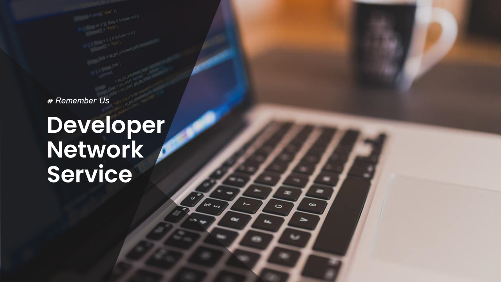
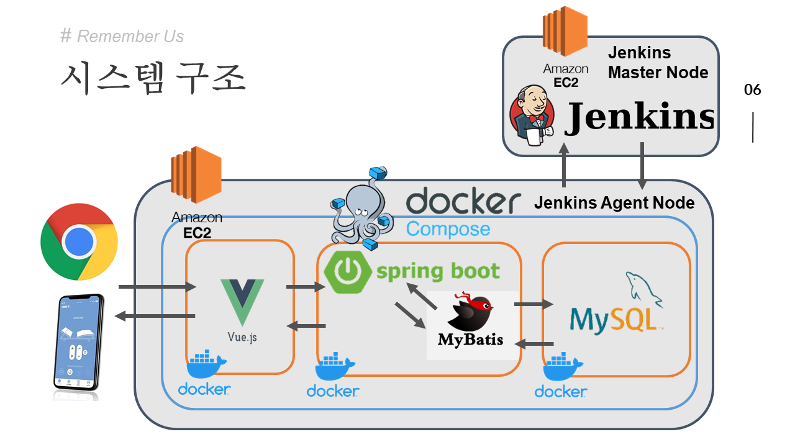
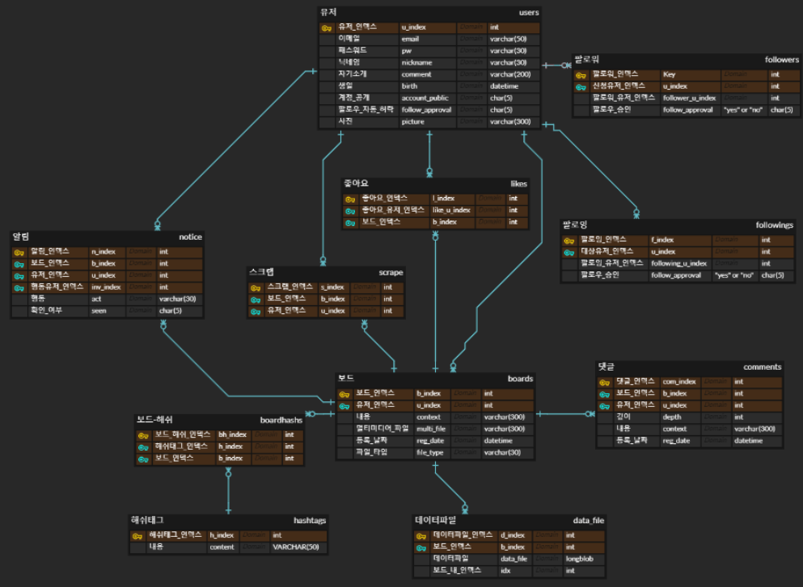
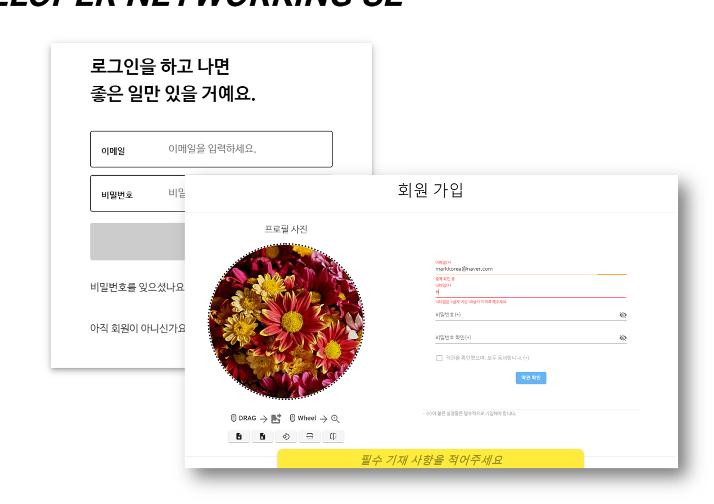
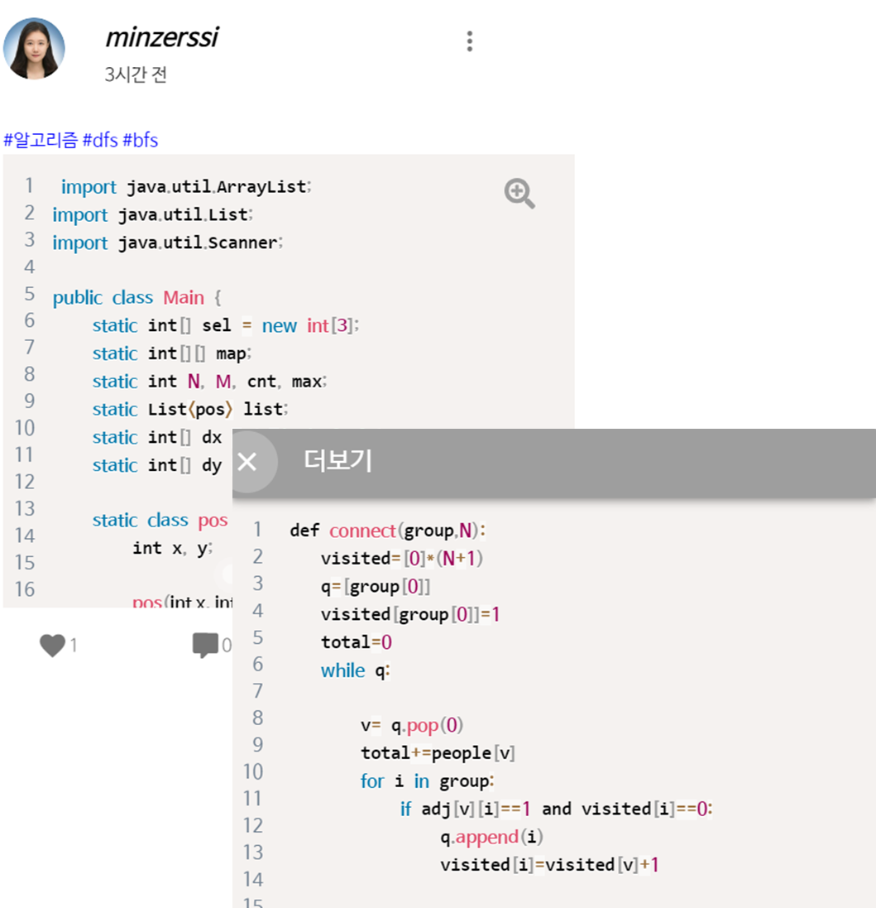
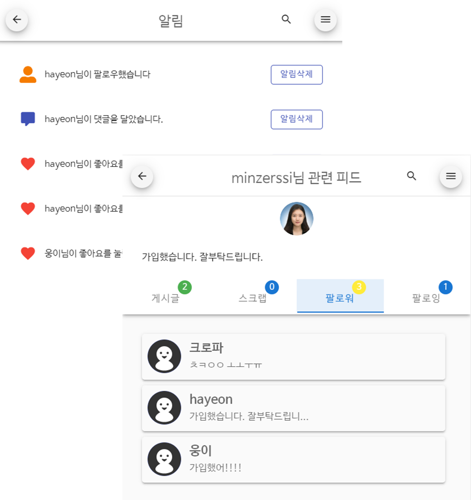
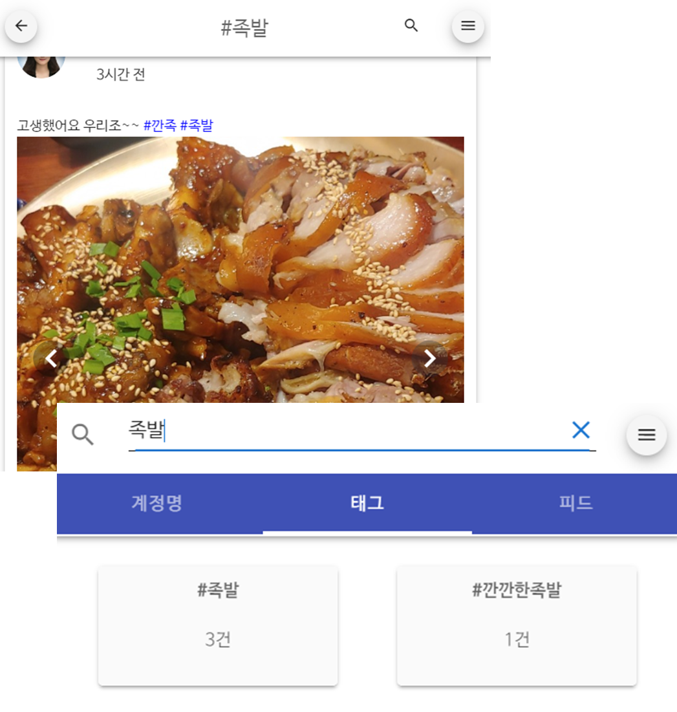
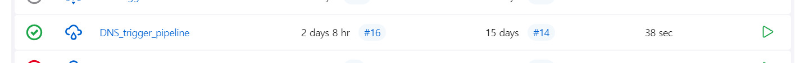

# DNS(Developer Network System)



> 회원 가입, 해쉬태그 검색, 팔로우, 알림 기능 등을 지원하며, 게시글에 그림, 영상, 코드 등을 공유할 수 있는 웹 기반 SNS

## 시연(Showcase)

<a class="badge-anchor" href="http://ec2-54-180-98-152.ap-northeast-2.compute.amazonaws.com/"></a>  
- 회원 가입 시, 개인 정보 유출이 우려될 경우 다음 아이디를 사용하세요
	- E-mail: asdf@naver.com
	- PW: asdf123!
<a class="badge-anchor" href="https://docs.google.com/presentation/d/1ATPpyd-QxKbGKslnmjN56FQJNkG6qhc7VcyjozlnZ6I/edit?usp=sharing"></a>
<a class="badge-anchor" href="http://ec2-54-180-98-152.ap-northeast-2.compute.amazonaws.com:8000/swagger-ui.html"></a>
- 서버 비용 관계로 일부 기간 동안에는 작동하지 않습니다.

## 기술 스택 및 구조(Tech stacks & Architecture)


### Tech Stacks
                  
- Vue, Vuetify, AWS, Spring boot, Mysql, Docker, Jenkins, Javascript, Jira, Git
## ERD


## 기능(features)

- **로그인-회원가입, 비밀번호 찾기, 변경**

- **포스트 등록, 댓글 등록, 코드, 영상, 사진 첨부**

- **팔로우, 포스트 스크랩, 알림 기능**

- **해쉬 태그, 본문 검색**



## 팀(Team)
### REMEMBER US
2020년 1월 13일~ 2020년 2월 20일 개발
- 이하연
- 김태동
- 최민혜
- 윤준석
- 남선웅

## 배포(Deployment)
### jenkins 배포
- github 프로젝트의 main branch push 시 빌드 자동 트리거
#### 수동 트리거 시

- 해당 프로젝트의 스케듈 빌드 버튼 클릭
### `docker-compose` 배포
```bash
// 슬레이브 노드 서버에서
cd [user-name]/DNS_renewal
docker-compose up -d
```

## License
@Team Remember Us™ All right reserved.